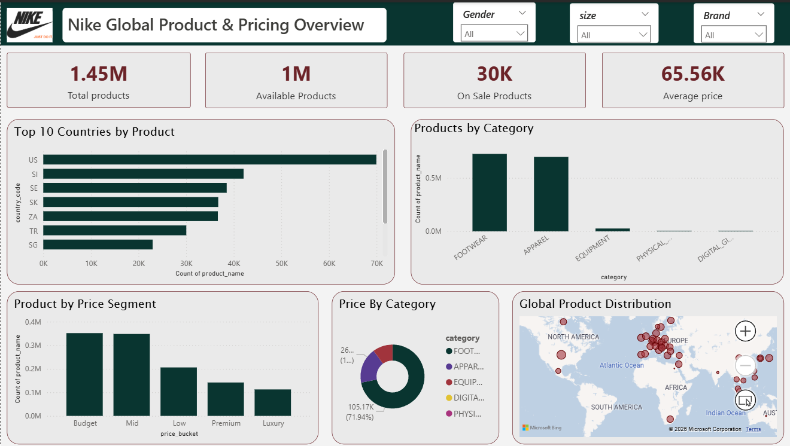

# Nike-Products-Sales
# Nike Product Analytics Dashboard

## Overview

This project analyzes Nike's product catalog at a granular SKU level (1.4M+ records), requiring careful preprocessing before insights could be derived. The final output is a single-page Power BI dashboard providing a clean overview of product distribution, pricing, and availability.

## Data & Files
Due to file size limitations, all project files are hosted externally:

Download Project Files (Power BI + Datasets):
https://drive.google.com/drive/folders/1aC-RL-6Fin11OcpqxamOb7_qKBZtNJCW?usp=drive_link

## Data Cleaning (Python / Pandas)

The raw dataset required significant preprocessing before it was usable:

- Removed empty and irrelevant columns to reduce noise and improve load performance
- Handled missing and inconsistent values across pricing, availability, and category fields
- Created derived fields including **price buckets** for segmentation analysis
- Validated key fields such as availability status and sale pricing
- Exported a clean, aggregated dataset for import into Power BI

---

## Data Modeling (Power BI)

The dataset contains multiple rows per product (one per size/SKU), which caused overcounting with naive aggregation.

Key modeling decisions:

- Used `DISTINCTCOUNT(product_id)` for all product-level counts
- Avoided unreliable flags like `is_on_sale` derived sale logic directly from pricing fields instead
- Built explicit DAX measures for:
  - Total Products
  - Available Products
  - Products on Sale
  - Average Price

---

## Dashboard

A single-page overview designed for quick exploration of the product catalog.

**KPIs**
- Total Products
- Available Products
- On Sale Products
- Average Price

**Visuals**
- Product distribution by category
- Top countries by product count
- Price segmentation by bucket
- Availability breakdown
- Geographic distribution (map)

**Interactivity**
- Filters by gender, brand, and other attributes
- All visuals update dynamically on selection

---

## Key Findings

- Footwear and apparel dominate the Nike product catalog
- Most products fall within mid-range pricing segments
- A significant share of products carry sale prices, though discount signals required derived logic due to inconsistent flags
- SKU-level granularity in the raw data is the primary source of data quality issues deduplication at the product level is essential

---

## Tools Used

| Tool | Purpose |
|------|---------|
| Python (Pandas) | Data cleaning and preprocessing |
| Power BI | Data modeling, DAX measures, visualization |

---

## Why This Project

The goal was not simply to build charts it was to work through the full pipeline of a messy, real-world dataset:

1. Identify and fix structural data quality issues
2. Apply correct aggregation logic to avoid misleading numbers
3. Build measures that reflect business meaning, not just raw counts
4. Present findings in a clear, structured format

---

## Notes

- The dataset operates at SKU level. Counting rows directly inflates product counts always aggregate at `product_id` level.
- Some fields (e.g. discount indicators) were inconsistent across records and could not be used directly.
- Raw data is excluded from this repo due to file size. A sample or the cleaned export can be provided on request.
